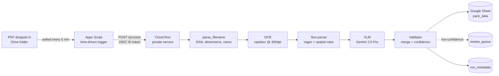
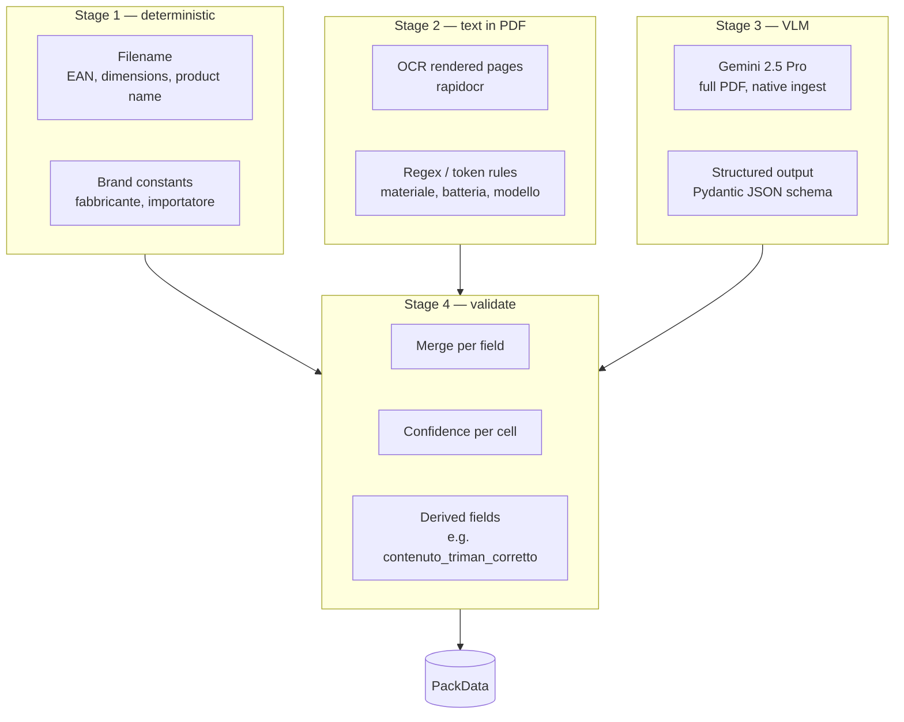

# Architecture

This document explains *why* the pipeline looks the way it does. For the
"how to deploy it" view, see [`DEPLOYMENT.md`](DEPLOYMENT.md). For the field
catalogue, the source of truth is `src/schemas/pack.py`.

## The problem in one paragraph

A printable packaging layout (Italian: *fustella*) is a vector PDF carrying
product text, regulatory icons, recycling codes, QR codes, and a handful of
brand-constant labels. We need 34 specific fields out of each PDF, written as
one row in a Google Sheet, with enough confidence signal that a human reviewer
only has to look at rows that are actually in doubt.

The hard part isn't that any one field is exotic — it's the *mix*. Some fields
are trivially extractable from the filename. Some are buried in body text. Some
are icons that have no text representation at all. A single extractor can't do
all three well, so the pipeline is layered.

## End-to-end flow

The same `run_single(pdf_path)` function powers the local CLI and the Cloud
Run server, which keeps the unit test surface honest — the server adds nothing
beyond HTTP plumbing and a Drive download.

## Why Apps Script instead of Eventarc

The original design called for Eventarc on `drive.onCreate`. That doesn't
work for a personal Google account. Eventarc consumes either Cloud Audit Logs
or Pub/Sub, and there is no first-class Drive event source — the closest you
get is Drive activity logs, which are only available on **Workspace
Enterprise** with Audit Logs piped into Cloud Logging. We don't have that, and
buying it just to wire a trigger would dwarf the entire project's cost.

So instead: an Apps Script project linked to the GCP project, with a
time-driven trigger that polls the watched Drive folder every five minutes and
POSTs each new file ID to the private Cloud Run endpoint with an OIDC ID
token. The token is signed by an `appsscript-invoker` service account
impersonated by the Apps Script execution context; Cloud Run validates it via
its built-in IAM auth (`roles/run.invoker`).

Five minutes — not one — because Cloud Run requests can take 100–300s when the
VLM retries, and a one-minute trigger window was firing the same fileId
multiple times before the first request returned 2xx. That caused duplicate
rows. Five minutes leaves comfortable headroom.

## The hybrid extractor

Each stage owns its own module and produces typed Pydantic objects. No raw
dicts cross module boundaries.

### Why OCR and not pdfplumber

The PDFs are vector but the text is converted to outlines (Adobe Illustrator's
"Crea contorni"), which means `pdfplumber.extract_text` returns ~10 useful
characters per page. That broke the original text-parsing strategy entirely.
We render pages with `pypdfium2` at 300 DPI and run `rapidocr-onnxruntime`
over them. RapidOCR catches Italian body text well; the small numeric suffixes
on disposal codes (e.g. the `21` in `PAP21`) it misses — those are VLM
territory anyway because the surrounding glyph is iconographic.

`pdfplumber` is still in the codebase as an alternate path for any future PDFs
that come in with real selectable text, but it isn't on the default path.

### Why a VLM at all

Two reasons.

First, several fields are *visual by definition*: the CE mark is a logo, not a
string. There's no text to extract for `simbolo_ce`. We need a vision model.

Second, even for textual fields the VLM gives us cheap gap-fill. If OCR
miscaught `IPX6` as `1PX6`, Gemini sees the original glyph and corrects it. We
exploit this in the validator: when both stages agree, confidence goes up;
when they disagree, the higher-confidence side wins and the cell is flagged
for review.

Gemini 2.5 Pro consumes the PDF natively (no per-page rendering on our side)
and returns structured JSON conforming to a Pydantic-derived schema. Each
field comes back as `{value, confidence, evidence}`, which is the same shape
the parser produces, so the merge step stays simple.

## Confidence model

Every non-deterministic field carries a confidence score in `[0, 1]`. The
validator combines parser and VLM confidence per field:

- **Both agree** → max(parser, VLM), bumped slightly.
- **Only one stage extracted** → that stage's confidence, capped.
- **They disagree** → the higher-confidence side wins; cell flagged.
- **Both empty** → confidence 0; cell rendered as `❌` or `N/A` per rules.

A pack's overall confidence is the minimum across its fields (one weak cell
poisons the row). When `overall_confidence < threshold`, `needs_review = True`
and the row goes into both `pack_data` and `review_queue`.

The threshold is tunable per deployment but currently lives in the validator.
In practice the heaviest knobs are the per-strategy ceilings: deterministic
fields are 1.0 by construction, text fields cap at 0.9, visual fields cap at
0.85.

## Sheet schema

Three tabs, in one Google Sheet:

| Tab | Purpose |
|---|---|
| `pack_data` | One row per processed pack. 34 columns, declared in `PackData._SHEET_FIELDS` order. Cell rendering: `✅` / `❌` for presence fields, raw value or `N/A` for extracted fields. |
| `review_queue` | Subset of `pack_data` rows where `needs_review == True`. Same schema. |
| `run_metadata` | Append-only log of every pipeline run: timestamp, filename, outcome (success/error), latency, error string. Used for idempotency lookups. |

`pack_data` writes are *positional* — `gspread.append_row` doesn't care about
the header text — so the sheet header is human-readable Italian (`Nome del
fabbricante`) rather than snake_case. The schema verifier checks column count,
not header text.

### Idempotency

EAN is the pack identity (extracted from the filename). Before incurring any
OCR or Gemini cost, the pipeline checks `run_metadata` for a prior successful
run on the same EAN-prefixed filename. If found, it short-circuits and
returns. This matters because Apps Script will keep retrying a fileId until
the request returns 2xx, and a slow first run can overlap with a second
poll cycle.

We also defend on the write side: `write_pack` is no-op when the EAN already
appears as a successful run. Two layers, because the cost of a duplicate row
is high (a reviewer has to dedupe by hand) and the cost of the check is two
sheet reads.

## Why these specific tools

| Choice | Reason |
|---|---|
| `pydantic` v2 | One schema definition drives both the runtime validation *and* the Gemini structured-output schema. |
| `google-genai` (new SDK) | The legacy `google-generativeai` package is being retired; the new SDK has first-class Pydantic schema support. |
| `rapidocr-onnxruntime` | CPU-only, no model download at runtime, ~1.6s cold-start, good Italian. |
| `loguru` over stdlib logging | One line to wire JSON output for Cloud Logging; `contextualize` is the right primitive for a request-scoped correlation ID. |
| `uv` | Fast resolver, lockfile, single-file `pyproject.toml`. |
| Cloud Run + Apps Script | Free-tier in `us-central1`. Eventarc would have been nicer but doesn't work for personal Drive (see above). |

## What's deliberately not in v1

- **Web UI for review queue triage.** A reviewer opens the Sheet and filters
  the `review_queue` tab. CLI is enough.
- **Active learning loop.** Human corrections don't yet flow back into the
  prompt or the schema.
- **Multi-language support.** Italian and English only; the prompts assume
  Italian-language packaging.
- **Workspace Shared Drive.** Personal Drive is fine for v1.
- **Prompt-version regression suite.** We have an eval cache and a
  deterministic eval harness, but not yet a full A/B regression on prompts.

These are roadmap, not blockers. Anyone proposing to build them should re-read
this section and confirm the scope creep is intentional.

## Operational characteristics

- **Throughput.** Cloud Run is configured `min-instances=0`,
  `max-instances=1`, `concurrency=1`. Serial processing, no concurrent Sheet
  writes. At 5-minute trigger intervals and ~150–250s per pack, this comfortably
  handles the expected ~50 PDFs/month.
- **Cold starts.** ~1.6s for the OCR engine, plus container start. Acceptable
  given trigger frequency. `min-instances=1` would eliminate cold starts but
  costs ~$5/mo always-on, outside budget.
- **Failure modes.** Pipeline errors are logged, written to `run_metadata`
  with `outcome=error`, and the request returns 202 anyway so Apps Script does
  not retry forever on a permanently-bad PDF. The error string is in the
  `run_metadata` row for triage.

## Repository pointers

| What | Where |
|---|---|
| Field schema (source of truth) | `src/schemas/pack.py` |
| Pipeline orchestration | `src/pipeline.py` |
| HTTP server | `src/server.py` |
| Sheet writer + idempotency | `src/sheets.py` |
| Prompts (versioned) | `prompts/extraction_v1.txt` |
| Apps Script trigger | `infra/apps-script/Code.gs` |
| Cloud Build pipeline | `infra/cloudbuild.yaml` |
| WIF setup for GitHub Actions deploy | `infra/gcp-setup-cicd.md` |
