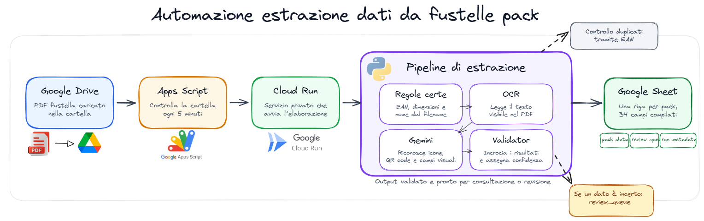

# fustelle-extractor

Drop a packaging PDF into a Google Drive folder. Within five minutes a
structured row appears in a Google Sheet — 34 fields, each with a confidence
score, and rows that need a human eye automatically flagged into a review
queue.

The PDFs are *fustelle*: Italian printable layouts for consumers' products packaging.
Each one carries product text, regulatory icons (CE, RAEE, TRIMAN…), QR
codes, recycling material codes, and a few brand-constant labels. The
pipeline is hybrid by design — deterministic parsing where the data is
reliable, a VLM (Gemini 2.5 Pro) for visual icons and gap-fill, and a
validator that reconciles the two with per-field confidence scoring.



## How it runs in production

```
Drive folder
    │  (PDF dropped here)
    ▼
Apps Script time-driven trigger (every 5 min)
    │  POST /process with OIDC ID token
    ▼
Cloud Run (private, us-central1)
    ├─ ocr.py        rapidocr (PDFs are vector-with-outlines, so plain
    │                text extraction returns nothing useful)
    ├─ parsing.py    filename parse + regex over the OCR text
    ├─ vlm.py        Gemini 2.5 Pro on the rendered pages
    ├─ validator.py  cross-check, confidence, derived fields
    └─ sheets.py     write to pack_data, log to run_metadata
```

A note on the trigger: Eventarc would be the obvious choice, but it doesn't
support personal Google Drive (you'd need Workspace Enterprise + Audit Logs).
Apps Script polling is the workaround. See `ARCHITECTURE.md` for the full
reasoning.

## Quick start (local)

```bash
uv sync
cp .env.example .env       # fill in GEMINI_API_KEY, sheet id, SA path
source .venv/bin/activate  # PowerShell: .venv\Scripts\Activate.ps1
python -m src.pipeline path/to/pack.pdf
uv run pytest
```

You can run the pipeline against a local PDF without ever touching Cloud Run —
the same `run_single` function is what the server calls.

## The 34 fields

Italian names, declared in `src/schemas/pack.py` in Sheet column order. Each
field is tagged by extraction strategy:

| Tag | What it means | Example |
|---|---|---|
| `deterministic` | Filename or brand constant. Confidence 1.0 by definition. | `nome_del_fabbricante`, `dimensioni` |
| `text_in_pdf`   | Recovered from OCR + regex. | `materiale`, `capacita_batteria_e_tensione_nominale` |
| `visual`        | VLM only — icons, QR codes, small disposal-code digits. | `simbolo_ce`, `simbolo_raee`, `qr_code_junker` |
| `derived`       | Computed from other fields. | `contenuto_triman_corretto` |

The Pydantic model is the source of truth — the Sheet writer derives column
order from it, so adding a field in one place updates both.

## Project layout

```
src/            one module = one responsibility
prompts/        versioned extraction prompts, loaded from disk at runtime
tests/          pytest. VLM tests use cassettes, never live API in CI.
infra/          Dockerfile, cloudbuild.yaml, GCP runbook, Apps Script source
samples/        sanitized PDFs for repro (real PDFs are gitignored)
notebooks/      EDA only, not part of the production path
```

## Costs

Steady state for ~50 PDFs/month: roughly **$1.50/mo** in Gemini API calls plus
**~$0.05–$0.15/mo** for Artifact Registry (the container image is ~530 MB,
slightly above the 0.5 GB free tier; a cleanup policy caps it at 2 retained
images). Everything else (Cloud Run, Cloud Build, Secret Manager, Cloud
Logging, Sheets, Drive) stays inside the always-free tier when pinned to
`us-central1` with `min-instances=0`. A $5/mo budget alert in Cloud Billing
is recommended to catch any drift.

## Documentation

- [`ARCHITECTURE.md`](ARCHITECTURE.md) — design decisions, the hybrid extraction
  model, why Apps Script instead of Eventarc, the confidence model.
- [`DEPLOYMENT.md`](DEPLOYMENT.md) — operator runbook: deploy, roll back,
  rotate the Gemini key, rerun a failed pack.
- [`infra/gcp-setup-cicd.md`](infra/gcp-setup-cicd.md) — Workload Identity
  Federation setup for the GitHub Actions deploy workflow.
